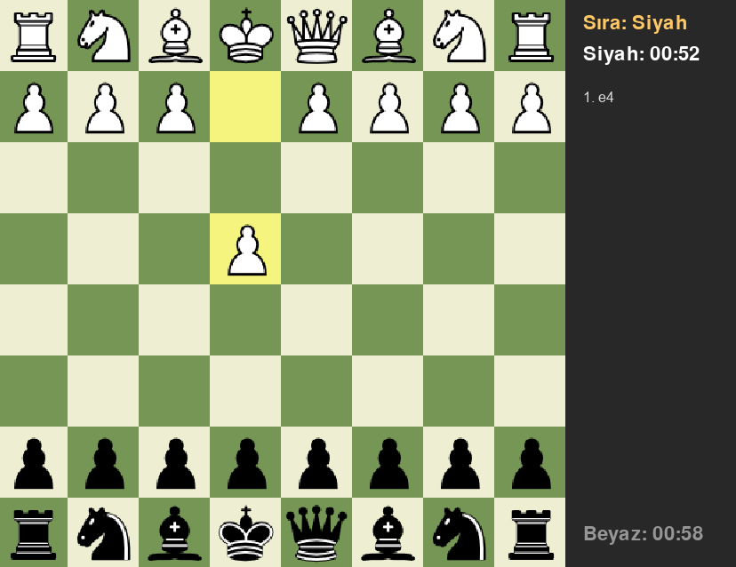
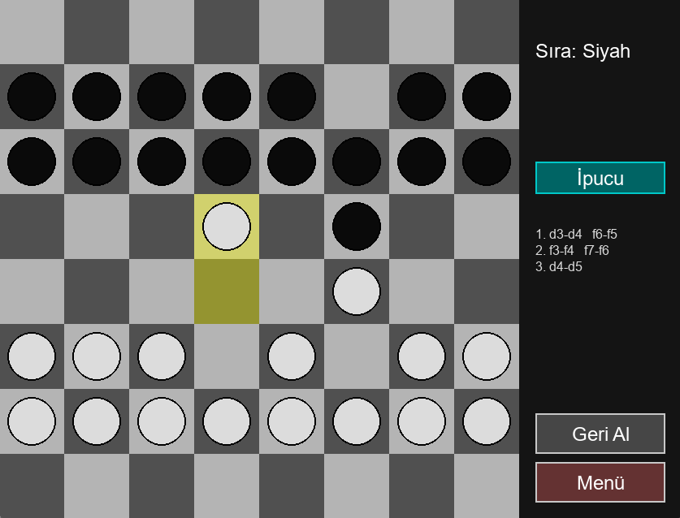

# Python Satranç Analiz Botu & Türk Daması AI

Bu proje, Python ve Pygame kütüphanesi kullanılarak geliştirilmiş iki ana strateji oyunu uygulamasını içerir: **Stockfish destekli Satranç Analiz Arayüzü** ve **Yapay Zekaya (AI) karşı oynanabilen Türk Daması**.


## 📂 Proje İçeriği

### 1. Satranç Analiz Sistemi (`gui_analysis.py`)
Güçlü satranç motoru **Stockfish** kullanılarak geliştirilmiş bir analiz arayüzüdür.
*   **Özellikler:**
    *   Görsel satranç tahtası (Pygame).
    *   Hamle geçmişi ve taş takibi.
    *   AI hamle önerileri ve pozisyon değerlendirmesi.
    *   Taraf seçimi ve zaman kontrolü ayarları.
    *   Yasal hamle kontrolü ve vurgulamalar.

### 2. Türk Daması (`turkish_draughts.py`)
Geleneksel Türk Daması kurallarına göre oynanan ve Minimax algoritması kullanan bir yapay zekaya sahip oyun.
*   **Özellikler:**
    *   **Akıllı Yapay Zeka:** Minimax algoritması ve Alpha-Beta budama (Kolay, Orta, Zor seviyeler).
    *   **Oyun İçi Araçlar:** Hamle geri alma, ipucu sistemi, menüye dönüş.
    *   **Görsel Temalar:** Klasik, Mavi, Ahşap ve Gri tema seçenekleri.
    *   **Tam Kural Seti:** Uçan dama, zorunlu alma (opsiyonel zincir) ve hareket kuralları.

## 📸 Ekran Görüntüleri

### Satranç Analiz Arayüzü


### Türk Daması


---

## ⚙️ Kurulum

Projeyi bilgisayarınızda çalıştırmak için aşağıdaki adımları izleyin.

### Gereksinimler

1.  **Python 3.x**'in yüklü olduğundan emin olun.
2.  Gerekli kütüphaneleri yükleyin:
    ```bash
    pip install -r requirements.txt
    ```

### Stockfish Kurulumu (Satranç İçin)

Satranç analizinin çalışması için Stockfish motoruna ihtiyacınız vardır:
1.  Stockfish Resmi Sitesinden işletim sisteminize uygun sürümü indirin.
2.  Proje klasörünün içinde `stockfish` adında bir klasör oluşturun.
3.  İndirdiğiniz `.exe` dosyasının adını `stockfish.exe` olarak değiştirin ve oluşturduğunuz klasörün içine atın.

**Dosya yapısı şöyle görünmelidir:**
```text
proje_klasoru/
├── analysis.py
├── gui_analysis.py
├── turkish_draughts.py
├── assets/           # Görseller ve sesler
└── stockfish/
    └── stockfish.exe
```

---

## 🚀 Nasıl Çalıştırılır?

### Türk Daması Oynamak İçin:
```bash
python turkish_draughts.py
```

### Satranç Analiz Arayüzü İçin:
```bash
python gui_analysis.py
```

### Satranç (Komut Satırı Modu) İçin:
```bash
python analysis.py
```

---

## 📄 Lisans

Bu proje **MIT Lisansı** ile lisanslanmıştır. Detaylar için `LICENSE` dosyasına bakınız.

**Geliştirici:** Emir ÇOBAN
```